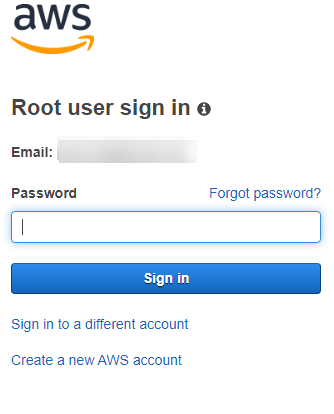

# AWS First Steps
AWS root account has the power to control everything in the account i.e. disable other users, groups and roles. Even deleting the account itself. 

Therefore it is essential to implement proper practices from the start to prevent root account compromise.

---
## Root account good practices

1. Always create administrator account
 
2. Your root account should **NEVER** * be used once administrator account is created
3. Secure your root accounts with strong passwords (32 to 64 characters). You want it to be brute-force attack resilient and you do not want anyone to be able to memorize it.
4. Always enable Multiple Factor Authentication (physical or software). Best practise is to have a physical MFA device. If it is too complex software based can be chosen.
5. Final advice to secure root accounts is: never create access keys to the root account to prevent logging-in programmatically.
---

*There are several tasks that require root account credentials. You can find complete list [here](https://docs.aws.amazon.com/general/latest/gr/root-vs-iam.html#aws_tasks-that-require-root). But at this point they are not important. 

## Creating new AWS account

In this part, we will describe the process of opening an AWS account, including adding your payment information. 

1. Sign-up console: Go to http://aws.amazon.com and click on Create an AWS Account, or directly go to https://portal.aws.amazon.com/billing/signup#/start

Fill in the details for Email address, Password, Confirm password, and AWS account name, and click Continue. Choose a strong password. I

2. Contact information

Provide company phone numbers rather than a personal cell phone. Configuring a root account with an individual email address or a personal phone number can make your account insecure.

You receive an email to confirm that your account is created. You can sign in to your new account using the email address and password you registered with. However, you can't use AWS services until you finish activating your account.

3. Payment Information

Provide Payment Information: 

4. Phone Verification

Please verify it by providing the displayed code when called or received an SMS, and once verified, you can see on the window that your phone is verified and you will be redirected to the next screen.

5. Choosing AWS Support Plan

Choose free for the initial state of development. For more details, please check [AWS support plans](https://aws.amazon.com/premiumsupport/plans/).

### Enable Multi-Factor Authentication (MFA)

You have an AWS Account created and now we can sign in to the AWS Management Console to start using the services. Go to https://console.aws.amazon.com/

NOTE:
This time sign-in as a root user. You do not use the root user for your everyday tasks, even the administrative ones. Most operations will be performed using different credentials. 

Provide the `Password` of your AWS account and click Sign in to log in 

... to the AWS Management Console.

If you click on your name (upper right corner), you will see a submenu that will allow you to access your billing, security and other services.

On the right side of the navigation bar, choose your account name, and choose `My Security Credentials` then expand the Multi-Factor Authentication (MFA) section on the page:

Virtual MFA device

Scan QR code from authentication app and type two verification codes from your authentication app.

Now in your Security Credentials page you can verify that MFA device was added to your account.

At this point you can also check additional security issues, which is disabling/deleting root access keys. Since this is a new AWS account, `Access keys` section should be empty. If there are any access keys listed in the table please remove them.

## Create administrator account

This time sign-in as a root user. You do not use the root user for your everyday tasks, even the administrative ones. Rest of operations will be performed using different credentials.

Go to IAM Console https://console.aws.amazon.com/iam/home#/home.

In the navigation pane, choose Users and then choose Add user.

For User name, enter Administrator. And set both programmatic and Management Console Access. Please use safe options required from new users to create new password when first sign-in. 

Choose the `Next: Permissions` button on the bottom of the page. Create new `Group`. 

In the Create group dialog box, for Group name enter Administrators. In the policy list, select the check box for `AdministratorAccess` which provides full access to AWS services and resources. Then choose Create group.

Choose `Next: Tags`. Please skip this step and choose `Next: Review`. You should see summary:

choose `Create user`.

You can download credentials as `.CSV` file and pass it to the NG team using a secure communication channel or send login instructions via email directly from the link provided in the window. 

From this moment you should not use the `Root` account for administrative purposes.

NOTE:
Download access credentials for `Administrator`. Sign out from your root account. Lock out safely root credentials.

## Article Related Resource

1. https://aws.amazon.com/premiumsupport/knowledge-center/create-and-activate-aws-account/
2. https://aws.amazon.com/premiumsupport/plans/
3. https://docs.aws.amazon.com/IAM/latest/UserGuide/id_root-user.html
4. https://docs.aws.amazon.com/IAM/latest/UserGuide/id_credentials_mfa.html
